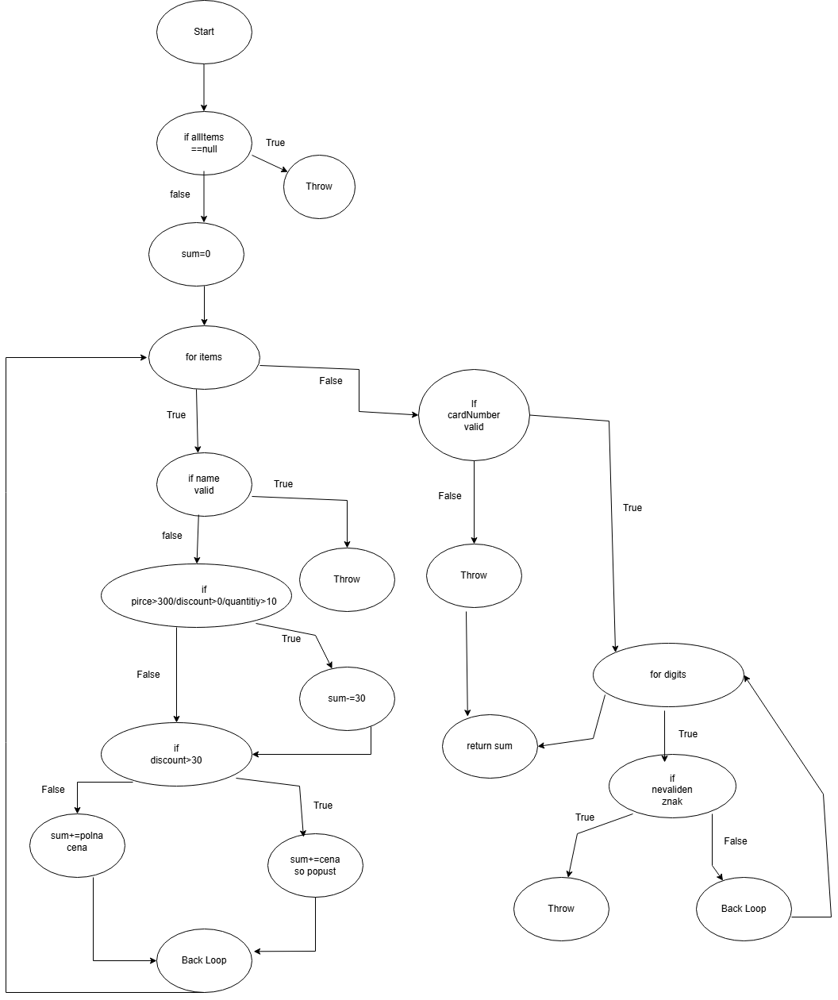

Константин Србиновски 192060

**Control Flow Graph**

**Цикломатска комплексност**

Цикломатска комплексност на кодот е 9,ја добив со формулата P+1 каде што P односно бројот на предиктани јазли беше 8 и плус 1 тоа е 9.Цикломатска комлекснот на кодот е 9
